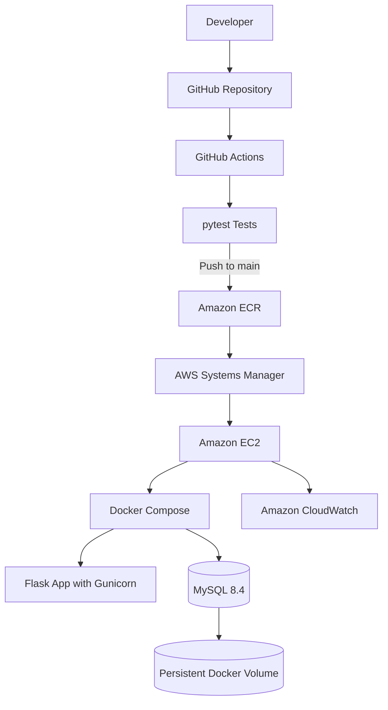

# Cloud Task App — Module 6 Capstone

A containerized task-management web application built with Flask and MySQL, deployed to AWS EC2, and delivered through an automated GitHub Actions CI/CD pipeline.

**Internship:** Cloud Computing & DevOps Internship  
**Organization:** Codomax Digital Solutions  
**Module:** Module 6 — Capstone Project

## Project Links

- **GitHub repository:** https://github.com/mayostiker/cloud-task-app-docker
- **Live application:** http://34.201.35.94
- **Application status:** Deployed and verified over HTTP
- **HTTPS:** Not yet configured; listed as a future improvement

## Project Overview

The Cloud Task App allows users to register, log in, and manage their own tasks. It demonstrates how an application can be containerized, tested automatically, stored in a container registry, and deployed to AWS.

The capstone brings together application development, database management, Docker, Git, GitHub Actions, AWS IAM, Amazon ECR, EC2, Systems Manager, and CloudWatch.

## Features

- User registration and login
- Password hashing instead of storing plain-text passwords
- Session-based authentication and logout
- Protected task dashboard
- Task creation, completion, and deletion
- Task ownership: users can access only their own tasks
- MySQL persistence using a Docker named volume
- Automated tests using pytest
- Automated Docker image publishing and EC2 deployment
- Application and infrastructure monitoring with CloudWatch

## Technology Stack

| Area | Technologies |
|---|---|
| Application | Python 3.12, Flask |
| Application server | Gunicorn |
| Database | MySQL 8.4 |
| Containers | Docker, Docker Compose |
| Testing | pytest |
| Source control | Git, GitHub |
| CI/CD | GitHub Actions |
| Container registry | Amazon ECR |
| Compute | Amazon EC2, Amazon Linux 2023 |
| Identity and access | AWS IAM, GitHub OIDC |
| Deployment | AWS Systems Manager (SSM) |
| Monitoring | Amazon CloudWatch |
| Local development | Ubuntu on WSL2 |

## Architecture



### Production components

**Web application**
- Runs in a Docker container using the image stored in Amazon ECR.
- Gunicorn serves Flask inside the container.
- EC2 port 80 maps to container port 5000.

**Database**
- MySQL 8.4 runs in a separate Docker container.
- The database uses the `mysql_data` named volume for persistent storage.
- The MySQL port is not published directly to the internet.
- The `tasks` table is related to the `users` table through a foreign key.

**AWS deployment**
- GitHub Actions authenticates to AWS using OpenID Connect (OIDC) and an IAM role.
- AWS Systems Manager sends deployment commands to the EC2 instance.
- Docker Compose updates the web service without intentionally recreating the database service or deleting its volume.

## CI/CD Pipeline

The workflow is defined in `.github/workflows/ci.yml`.

### Continuous Integration

On pushes to `main` and `module-6-capstone`, and on pull requests targeting `main`, the workflow installs dependencies and runs the automated tests.

### Continuous Deployment

For pushes to `main`, the workflow also:

1. Authenticates to AWS using GitHub OIDC.
2. Logs in to Amazon ECR.
3. Builds the Docker image.
4. Tags the image with the Git commit SHA and `latest`.
5. Pushes the images to Amazon ECR.
6. Runs `scripts/deploy.sh`.
7. Uses SSM to update the application on EC2.

The deployment job is restricted to pushes to `main`. Feature-branch and pull-request runs do not deploy to production.

### Image versioning

The commit-SHA image tag identifies the application version associated with a specific Git commit. The `latest` tag is updated by the workflow on pushes to `main`.

## Authentication and Database Design

The application uses a `users` table and associates each task with a user through `tasks.user_id`.

Security and integrity controls include:

- Password hashes are stored instead of plain-text passwords.
- Authentication is required to access the task dashboard.
- Task queries and updates are restricted to the authenticated user.
- The `user_id` column is required.
- The `fk_tasks_user` foreign key references `users.id`.
- The database schema migration is documented in `migrations/001_add_user_auth.sql`.

The existing production tasks were assigned to the `moyo` account. After deployment, logging in as `moyo` was verified to display all eight existing tasks.

## Testing and Verification

The project was verified at several levels.

### Automated tests
- Local test suite: **15 tests passed**.
- GitHub Actions CI: completed successfully.

### Live application checks
The deployed endpoints returned the following results:

| Endpoint | Expected result | Verified result |
|---|---|---|
| `/login` | HTTP 200 | HTTP 200 |
| `/register` | HTTP 200 | HTTP 200 |
| `/` without login | Redirect to login | HTTP 302 |

### Functional verification
- Successfully logged in using the `moyo` account.
- Confirmed that all eight existing tasks were visible.
- Confirmed that the production application was reachable after deployment.

## Local Setup

### Prerequisites

Install or have access to:
- Git
- Docker and Docker Compose
- Python 3.12 for running tests locally

### 1. Clone the repository

```bash
git clone https://github.com/mayostiker/cloud-task-app-docker.git
cd cloud-task-app-docker
```

### 2. Configure environment variables

Create a local environment file:

```bash
cp .env.example .env
```

Edit `.env` and replace the example database passwords and `SECRET_KEY` with your own local values. Never commit `.env` or real credentials to Git.

### 3. Start the application

```bash
docker compose up -d --build
```

The local application is available at:

`http://localhost:5000`

### 4. View logs and container status

```bash
docker compose ps
docker compose logs web
docker compose logs db
```

### 5. Run automated tests

Activate your Python virtual environment if you use one, install dependencies, and run:

```bash
pip install -r requirements.txt
pytest -v
```

To stop the local containers without deleting the database volume:

```bash
docker compose down
```

Do not use `docker compose down -v` if you need to preserve the local database data.

## Configuration and Secrets

The repository includes `.env.example` with placeholder values for required configuration.

Sensitive values are supplied through environment variables and are not intended to be committed to Git. The production `.env` file is stored on the EC2 instance and excluded from version control.

GitHub Actions uses OIDC to obtain AWS credentials rather than storing long-lived AWS access keys in repository files.

## Monitoring

Amazon CloudWatch is used for infrastructure and application monitoring.

The existing monitoring configuration uses:
- Custom namespace: `Module5/CloudTaskApp`
- Application log group: `/module5/cloud-task-app`

These resources support monitoring of EC2 metrics and access to application logs. The names retain the earlier module numbering from the project's development history.

## Security Notes and Known Limitations

- The live application currently uses HTTP. HTTPS has not yet been configured.
- Before using the application for real users, configure HTTPS and secure session-cookie settings.
- Keep database passwords and the Flask `SECRET_KEY` out of source control.
- Review EC2 security-group rules and restrict inbound access to the ports that are required.
- MySQL should remain inaccessible directly from the public internet.
- Review AWS resource usage and costs after testing.

## Project Structure

```text
.
├── app.py
├── Dockerfile
├── docker-compose.yml
├── docker-compose.prod.yml
├── init.sql
├── requirements.txt
├── .env.example
├── .github/
│   └── workflows/
│       └── ci.yml
├── migrations/
│   └── 001_add_user_auth.sql
├── scripts/
│   └── deploy.sh
├── static/
│   └── style.css
├── templates/
│   ├── index.html
│   ├── login.html
│   └── register.html
└── tests/
    └── test_app.py
```

## Learning Outcomes

This capstone provided practical experience with:

- Building and testing a Flask application
- Implementing authentication and user-specific authorization
- Designing relational database relationships and migrations
- Containerizing a multi-service application
- Managing persistent database storage
- Automating tests with pytest
- Building and publishing Docker images with GitHub Actions
- Using GitHub OIDC and IAM for AWS authentication
- Deploying applications through AWS Systems Manager
- Using CloudWatch for monitoring
- Troubleshooting CI/CD and production deployment issues

## Future Improvements

- Configure HTTPS using a suitable TLS termination approach.
- Consider moving the database to Amazon RDS for managed database operations.
- Add stronger operational alerting and additional integration tests.
- Continue reviewing IAM permissions, network access, and AWS costs.

## Conclusion

The Cloud Task App capstone demonstrates an end-to-end workflow from application development and automated testing to container image publishing and deployment on AWS. The production login flow and access to the existing tasks were verified after deployment.

